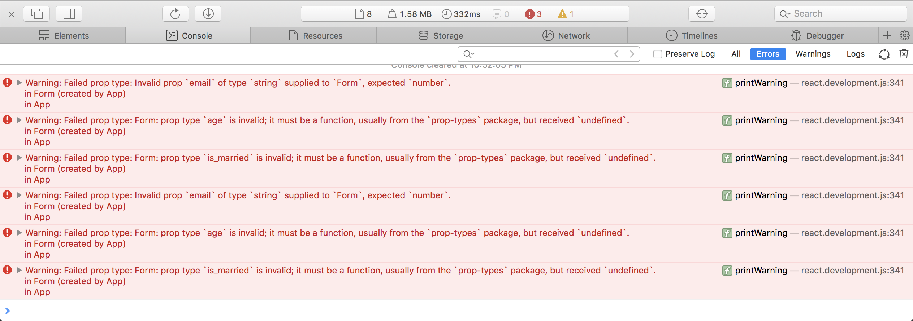
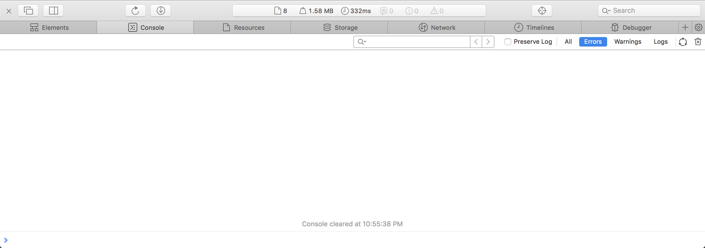

Исправить ошибки программиста
===

Один из программистов подготовил страницу, которая содержит 
на себе компонент формы `Form` с анкетой и компонент меню `Menu`.
К сожалению он плохо 
разбирался в `PropTypes` и теперь на страницу возникают 
ошибки, как при открытии страницы, так и при заполнении 
формы.

Известно, что у компонента `Form` имеются ошибка `PropTypes`, 
а у компонента `Menu` они настроены верно, но ошибки содержатся
в дарнных, которые передаются в `props` компонента.

Ваша задача - внести изменения, которые позволят 
коду заработать без ошибок.

Консоль браузера с ошибками 

Консоль браузера после исправления ошибок не должна содержать ошибок

## Реализация

Используя информацию об ошибках в консоли браузера внести изменения в существующие правила `Form.propTypes` и 
`Form.defaultProps` таким образом, чтобы код стал работать корректно.
Обратите внимание на то, что поля отмеченные звездочкой являются обязательными для заполнения.

### Локально с использованием git

Компонент формы находится в файле `./js/Form.js`

### В песочнице CodePen

Измените компонент во вкладке JS(Babel). Перед началом работы сделайте форк этого пена:

https://codepen.io/anonimizer_me/pen/yKKpvx
